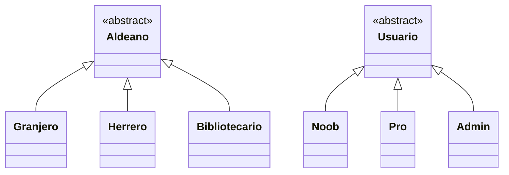

# Minecraft Villager Management 

## Problema a resolver:
Se tiene una cantidad no manejable de aldeanos en cierta zona de un mundo de Minecraft. Los jugadores tienen dificultades para organizar, registrar y administrar
esta zona, por lo tanto, se busca facilitar y llevar a cabo un sistema que permita la gestion eficiente de este recurso digital.

## Usuarios del sistema
| Usuarios | Tarea desempeñada  |
| -------- | -------------------|
| Noob | Vista superficial del registro de aldeanos por objeto a la venta y sus coordenadas |
| Pro | Vista detallada del registro y permisos para registrar aldeanos en el sistema sistema |
| Admin | Tiene el control total del sistema, encargado principalmente de mantener la estabilidad en el sistema |

## Diagrama UML (Avance)

